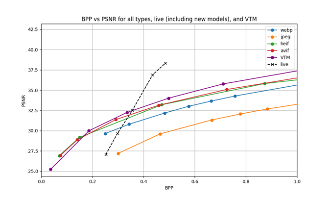
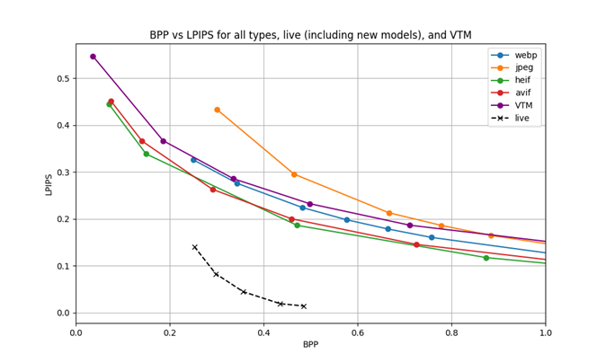

# LIVE – Latent Image and Video Encoding

This repository contains the implementation of the LIVE (Latent Image and Video Encoding) compression method, as described in our paper by John P. Plasterer, Lin Xu, and Hsuan-Ting Yang from NETINT Technologies Inc. and the University of British Columbia.

## Overview

LIVE is a novel approach to image and video compression that operates directly in the latent space of generative models. Instead of compressing pixel content after latent decoding, which operates in a larger information space, we compress the latent representations either before or after the diffusion process. This approach is particularly efficient for generative AI applications, as it:

- Reduces computational overhead by working in a more compact latent space
- Achieves better compression ratios compared to traditional codecs at similar quality levels
- Shows significant improvements in perceptual metrics (LPIPS)
- Integrates seamlessly with existing generative AI pipelines

## Key Features

- Neural network-based compression optimized for latent spaces
- Entropy optimization structure with hyperprior model
- Compatible with pre-trained VAE models (e.g., Stable Diffusion's VAE)
- Improved PSNR and LPIPS metrics compared to traditional codecs
- Efficient compression and decompression pipeline

## Folder structure
```
├── checkpoints             # Model checkpoints from training
├── kodak                   # Kodak dataset for evaluation
├── assets                  # README documentation images
├── model                   # Model architecture and loss functions
│   ├── model.py           # Core compression model architecture
│   └── rate_distortion_custom.py # Rate-distortion loss implementation
├── testing                 # Evaluation scripts (LPIPS, PSNR, comparison with JPEG/HEIF/WebP)
├── training               # Training pipeline and datasets
├── trained_models         # Pre-trained model weights
├── vtm                    # VTM comparison benchmarks
├── sweep_lambda.csh       # Script for training with different lambda values
└── requirements.txt       # Python dependencies
```

## General Setup

1. Create and activate a Python virtual environment
2. Install dependencies:
```bash
pip install -r "requirements.txt"
```
3. Follow setup instructions in the `kodak`, `testing`, and `training` folders

## Performance

Our method demonstrates:
- Superior perceptual quality (LPIPS) compared to traditional codecs
- Competitive PSNR values at various bitrates
- Efficient compression/decompression on modern hardware
- Particular effectiveness at low bitrates while maintaining perceptual quality

### Performance Graphs

#### PSNR vs Bits Per Pixel (BPP)


PSNR vs bpp curve comparison for JPEG, WebP, HEIF, VTM and LIVE (ours) on the Kodak dataset. Note that the f=8 c=4 VAE used for this experiment has a bpp of 2. The images are 768x512 24-bit RGB color images.

#### LPIPS vs Bits Per Pixel (BPP)


LPIPS vs bpp curve comparing WebP, JPEG, HEIF, VTM to LIVE (ours) on the Kodak dataset. Lower LPIPS values indicate better perceptual quality.

## Citation

If you use this code in your research, please cite our paper:

```
[Citation information to be added]
```
## License

This project is licensed under the BSD 3-Cause Clear License

## Acknowledgements

We thank Interdigital for their CompressAI python library, which helped accelerate the development of this project.
